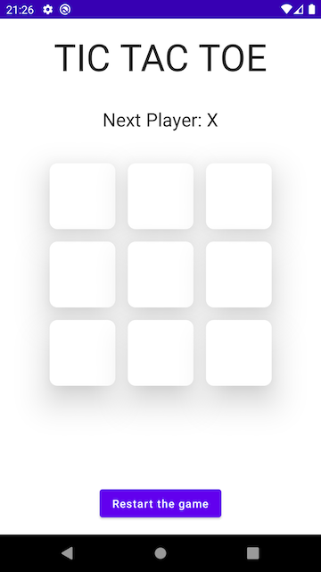
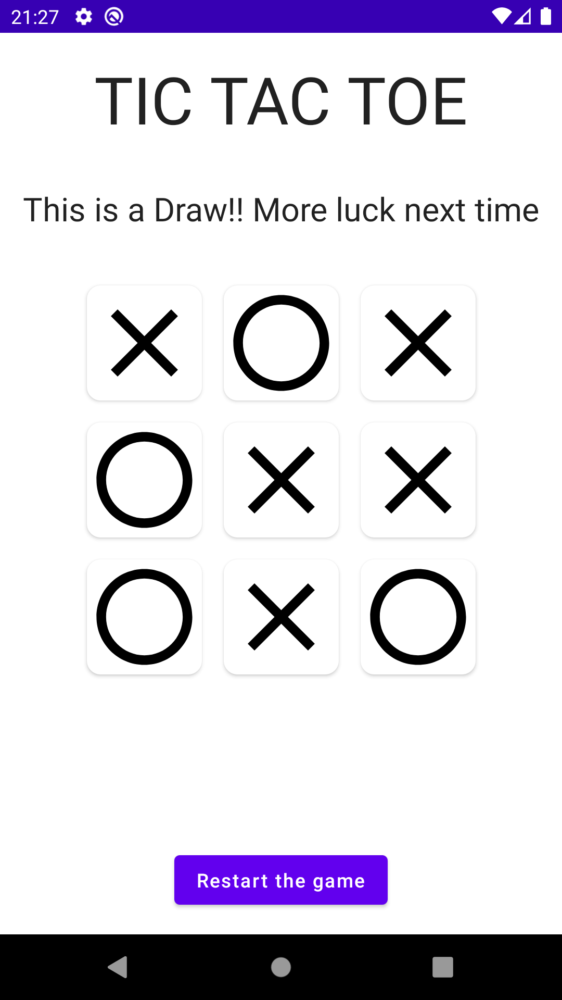

# MyTest

This is the code challenge for the BNP interview process.
It is a basic application that allows to users to play Tic-Tac-Toe in an Android device.

## How to compile and run the code

This is a regular Android project so you will have to open it with Android Studio, fetch
the dependencies and hit run to get the application installed in an emulator or a physical
device connected to your machine.

#### Requirements to compile and install the application
- Android Studio 2020.3.1 (Arctic Fox) or newer
- Device or emulator running Android 6 or newer (Minimum API 23)
- Minimum SDK version is API level 23 so you might need to install it in your machine
- Compile SDK version is API level 31 so you might need the builds tools for API 31
- Kotlin version is 1.5.30
- Gradle version is 7.0.2

Once you have these in your machine, you can compile the project, run it in your emulator
or device and after some minutes you will have the game ready.

## About this Kata

This short and simple Kata should be performed using **Test Driven Development** (TDD).

## Rules

The rules are described below :

- X always goes first.
- Players cannot play on a played position.
- Players alternate placing X’s and O’s on the board until either:
	- One player has three in a row, horizontally, vertically or diagonally
	- All nine squares are filled.
- If a player is able to draw three X’s or three O’s in a row, that player wins.
- If all nine squares are filled and neither player has three in a row, the game is a draw.

## Screenshots

